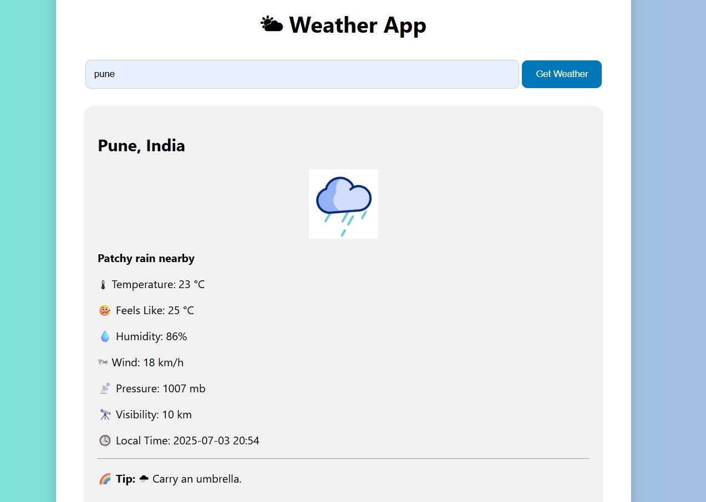

# 🌤 Weather App

A simple and elegant weather application built using **HTML**, **CSS**, and **Vanilla JavaScript** that displays real-time weather information powered by the **Weatherstack API**.

---

## ✨ Features

- 🔍 Search weather by **city name**
- 🌄 Dynamic **background**  
- 🖼 Weather **icons** using animated GIFs
- 💡 **Smart weather tips** (e.g., carry an umbrella, wear sunglasses)
- 📱 Fully **responsive design** for all screen sizes

---

## 📸 Preview

  

---

## 🛠️ Tech Stack

- **HTML5**
- **CSS3**
- **Vanilla JavaScript**
- **Weatherstack API**

---

## 🔧 Installation & Setup

1. **Clone the repository**
   ```bash
   git clone https://github.com/Subhasis495/Weather-App.git
   cd weather-app
2. **Get a free API key from Weatherstack**

3. **Configure your key**

4. **Open script.js and replace:**

const accessKey = "YOUR_ACCESS_KEY";

➤ with your actual API key.

Run the App

---

### 📄 License
This project is free to use for personal and educational purposes.
